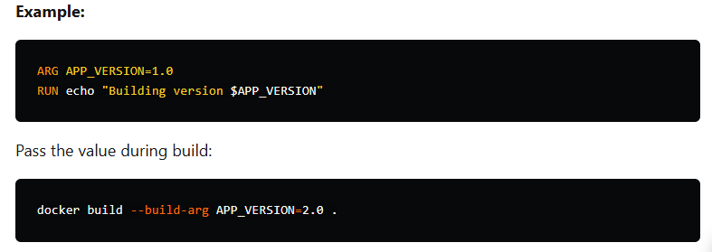
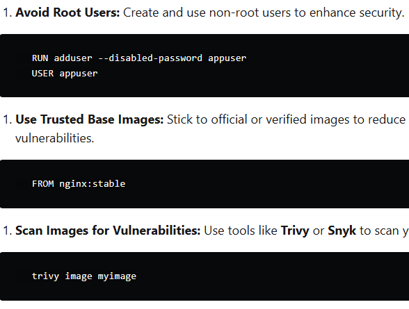

Advanced techniques help you create optimized, secure, and production-ready images.

5.1 Optimizing Image Size
Use Smaller Base Images

Replace default images with minimal ones, like alpine.
 FROM python:3.9-alpine
Minimize Layers

Combine commands to reduce the number of layers:
 RUN apt-get update && apt-get install -y curl && apt-get clean
5.2 Using Build Arguments
Build arguments (ARG) allow dynamic configuration of images during build time.

Example:

ARG APP_VERSION=1.0
RUN echo "Building version $APP_VERSION"
Pass the value during build:

docker build --build-arg APP_VERSION=2.0 .
5.3 Implementing Security Best Practices
Avoid Root Users: Create and use non-root users to enhance security.
   RUN adduser --disabled-password appuser
   USER appuser
Use Trusted Base Images: Stick to official or verified images to reduce the risk of vulnerabilities.
   FROM nginx:stable
Scan Images for Vulnerabilities: Use tools like Trivy or Snyk to scan your images:
   trivy image myimage

