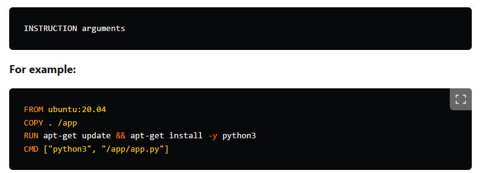

Basics of a Dockerfile
Understanding the basics of a Dockerfile is crucial to writing effective and functional ones. Let’s explore the foundational elements.

3.1 Dockerfile Syntax
A Dockerfile contains simple instructions, where each instruction performs a specific action. The syntax is generally:

INSTRUCTION arguments
For example:

FROM ubuntu:20.04
COPY . /app
RUN apt-get update && apt-get install -y python3
CMD ["python3", "/app/app.py"]
Key points:

Instructions like FROM, COPY, RUN, and CMD are case-sensitive and written in uppercase.
Each instruction creates a new layer in the Docker image.

