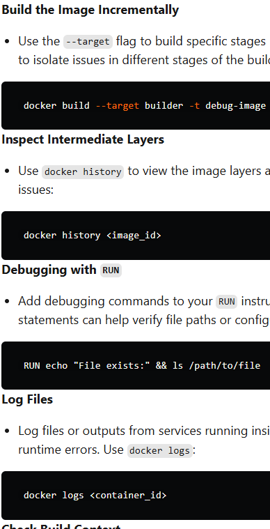

Debugging and Troubleshooting Dockerfiles
When working with Dockerfiles, encountering errors during the image build or runtime is common. Effective debugging and troubleshooting skills can save time and help pinpoint issues quickly.

Steps to Debug Dockerfiles
Build the Image Incrementally

Use the --target flag to build specific stages in multi-stage Dockerfiles. This allows you to isolate issues in different stages of the build process.
 docker build --target builder -t debug-image .
Inspect Intermediate Layers

Use docker history to view the image layers and identify unnecessary commands or issues:
 docker history <image_id>
Debugging with RUN

Add debugging commands to your RUN instruction. For example, adding echo statements can help verify file paths or configurations:
 RUN echo "File exists:" && ls /path/to/file
Log Files

Log files or outputs from services running inside the container can provide insights into runtime errors. Use docker logs:
 docker logs <container_id>
Check Build Context

Ensure that unnecessary files aren’t being sent to the build context, as this can increase build time and cause unintended issues. Use a .dockerignore file to filter files.

