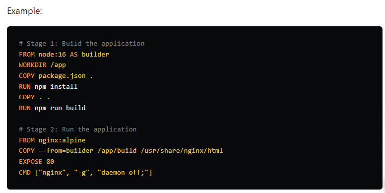
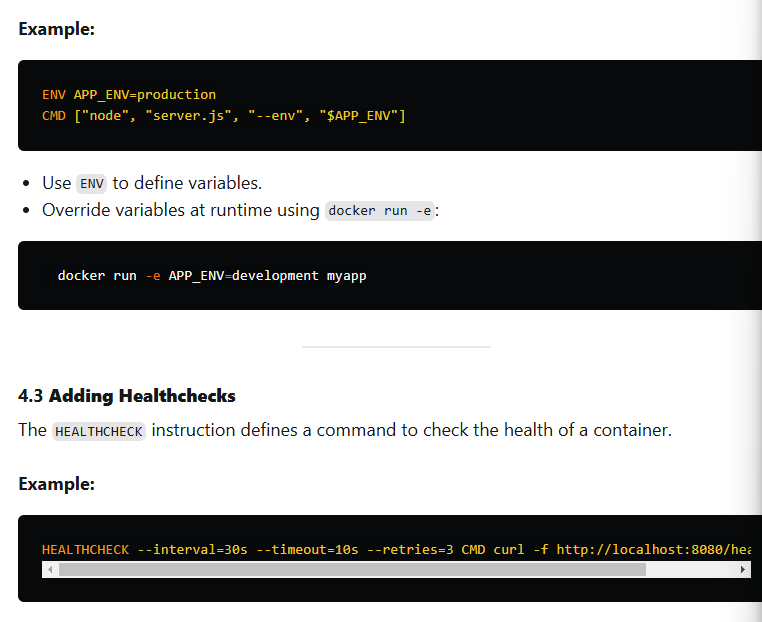

Intermediate Dockerfile Concepts
Once you understand the basics, you can start using more advanced features of Dockerfiles to optimize and enhance your builds.

4.1 Building Multi-Stage Dockerfiles
Multi-stage builds allow you to create lean production images by separating the build and runtime environments.

Stage 1 (Builder): Install dependencies, compile code, and build the application.
Stage 2 (Production): Copy only the necessary files from the build stage.
Example:

# Stage 1: Build the application
FROM node:16 AS builder
WORKDIR /app
COPY package.json .
RUN npm install
COPY . .
RUN npm run build

# Stage 2: Run the application
FROM nginx:alpine
COPY --from=builder /app/build /usr/share/nginx/html
EXPOSE 80
CMD ["nginx", "-g", "daemon off;"]
Benefits:

Smaller production images.
Keeps build tools out of the runtime environment, improving security.
4.2 Using Environment Variables
Environment variables make Dockerfiles more flexible and reusable.

Example:

ENV APP_ENV=production
CMD ["node", "server.js", "--env", "$APP_ENV"]
Use ENV to define variables.
Override variables at runtime using docker run -e:
  docker run -e APP_ENV=development myapp
4.3 Adding Healthchecks
The HEALTHCHECK instruction defines a command to check the health of a container.

Example:

HEALTHCHECK --interval=30s --timeout=10s --retries=3 CMD curl -f http://localhost:8080/health || exit 1
Purpose: Ensures that your application inside the container is running as expected.
Automatic Restart: If the health check fails, Docker can restart the container.

